# SW102 Modded Firmware for Bafang Controllers

Open source firmware for the Bafang SW102 display, built for genuine Bafang mid-drive motors. A complete rewrite of the display's firmware - live telemetry, full assist control, lights, and a redesigned cockpit and menu, all running natively on your existing hardware. The end goal: full integration with the **EggSPEED** Android app ([GitHub](https://github.com/moskil2/EggSPEED), [Google Play](https://play.google.com/store/apps/details?id=app.spotrobotics.eggspeed)) over Bluetooth.

[](https://www.youtube.com/watch?v=YrcN-K4wGN4)

| 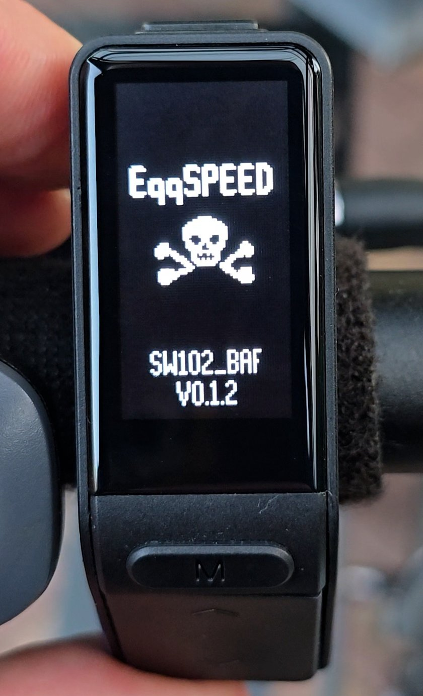 | 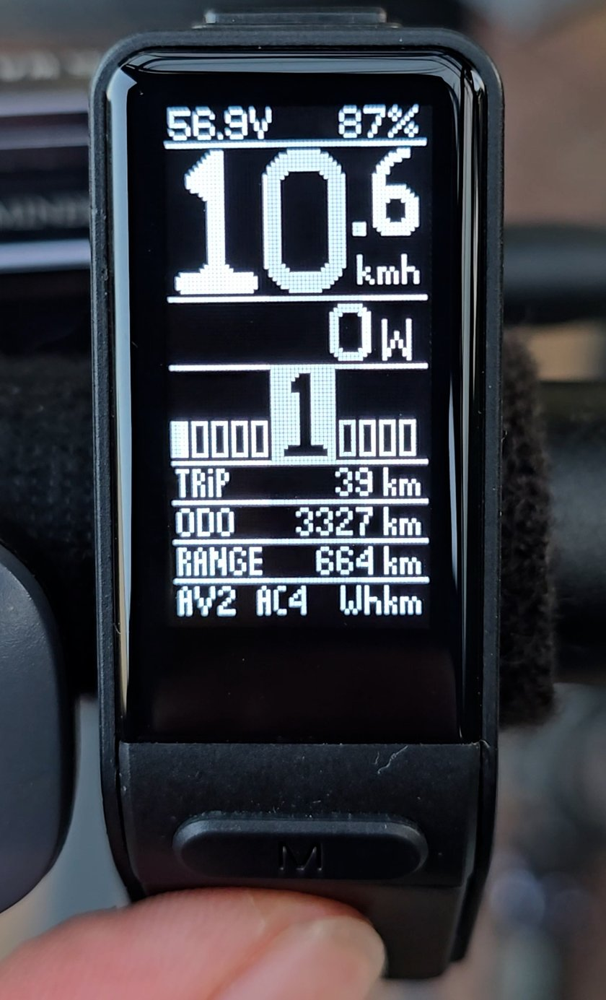 | 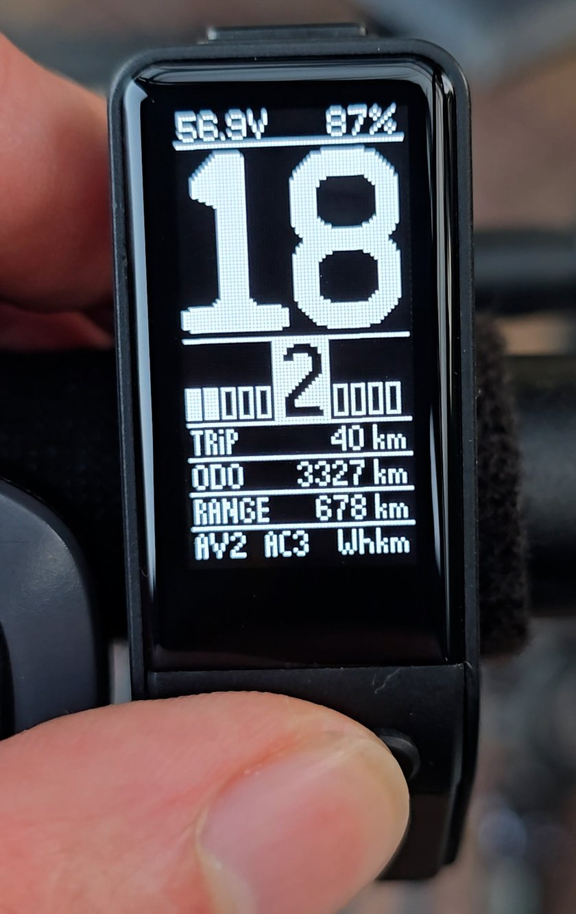 | 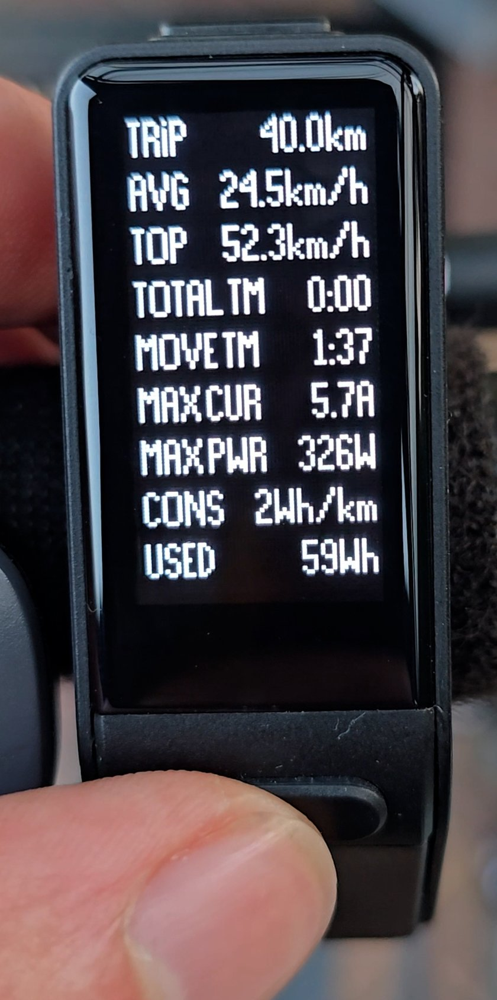 |
|:---:|:---:|:---:|:---:|
| Boot screen | Cockpit (layout 1) | Cockpit (layout 2) | Data screen (layout 3) |

| 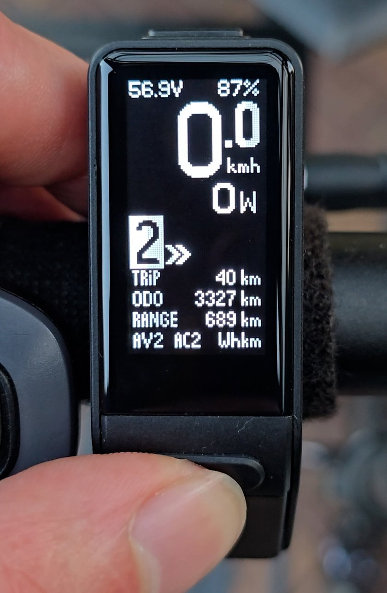 | 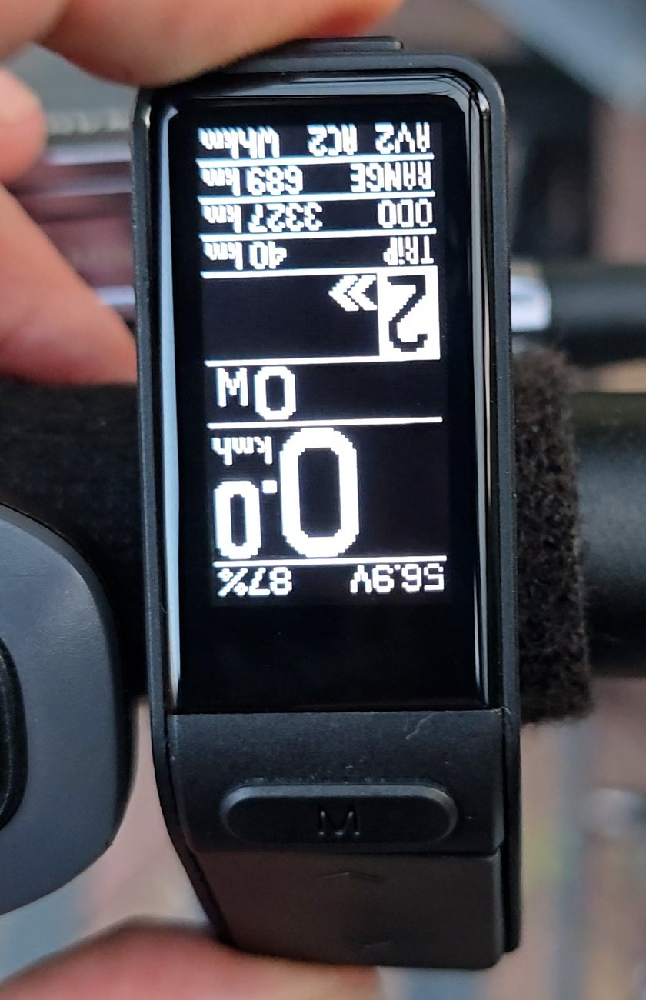 | 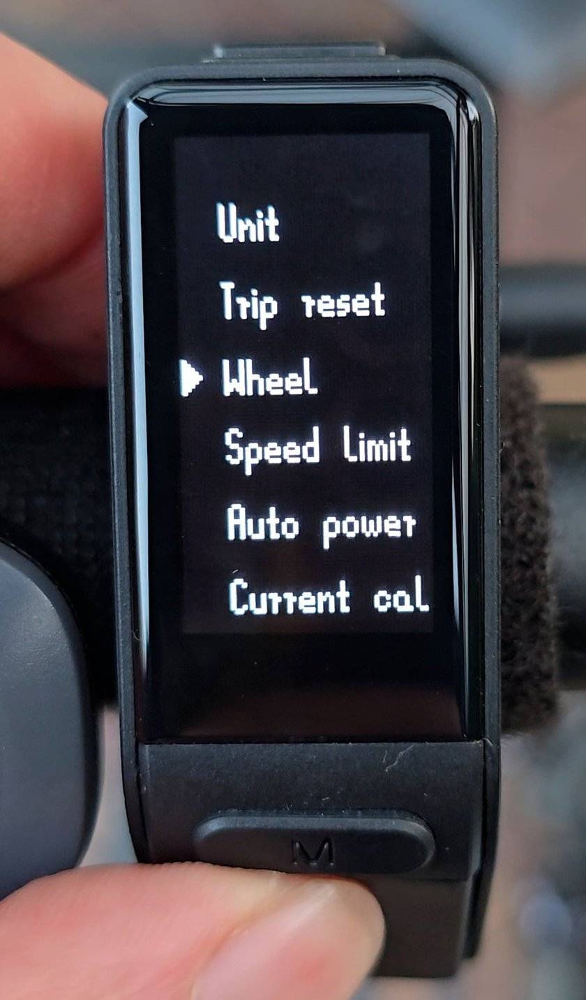 | 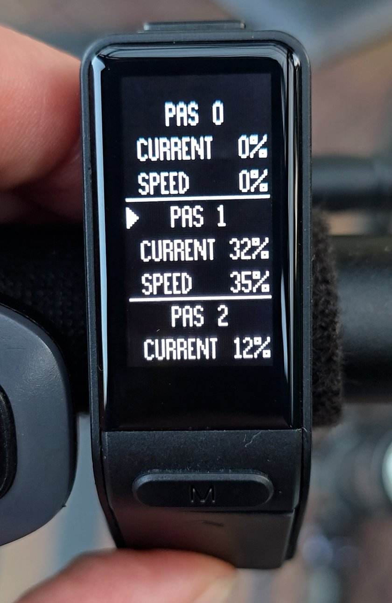 |
|:---:|:---:|:---:|:---:|
| PAS Type B | Rotated 180 degrees | Menu (top level) | Assist Level Programming |

## Compatibility

Uses the standard Bafang UART display protocol - the same protocol the stock display uses across this whole controller family:

- BBS01 / BBS01B
- BBS02 / BBS02B
- BBSHD
- M400
- M420
- M620 / G510 Ultra

Tested on real hardware with a BBSHD controller.

## Cockpit (main screen)

- Top bar: battery voltage (left) and battery percentage (right)
- Speed: large digits with one decimal, unit label (km/h or mph)
- Power: motor power in watts
- Assist level: two selectable layouts (Type A/B, see Menu below) - a centered number with a 10-segment bar-graph indicator, or the number to one side with the level shown as a row of arrows; status icons (headlight, Bluetooth connection, brake) either way, replaced by an animated walk-assist icon while walk assist is held
- Trip distance, Odometer, and estimated Range rows
- Average / current energy consumption row (Wh/km or Wh/mile)
- Optional separator lines between rows (toggle in menu)
- Three cockpit layouts, cycled with a short press of M: the standard layout above, a second one that merges the speed and power rows into one large whole-number speed readout, and a third "data screen" listing trip distance, average and top speed, total and moving time, maximum current and power, average consumption (Wh/km) and energy used (Wh). All of these values are remembered across power-off, like TRIP, and cleared only by "Trip reset" (consumption is the average over the trip: energy used divided by trip distance)
- Controls: UP/DOWN short press = assist level up/down; UP long press = toggle headlight; DOWN long press (hold) = walk assist; M short press = cycle cockpit layout; M long press = open menu

## Menu

- Unit switch (km/h / mph)
- Wheel size selection
- Speed limit (sent directly to the controller)
- Auto power off timer
- Current calibration (adjustable display multiplier)
- Voltage calibration (adjustable display multiplier)
- ODO (manually set or correct the odometer)
- Battery submenu: pack capacity (Wh)
- Brightness submenu: manual or automatic mode, adjustable level
- Cockpit submenu: toggle separators, toggle the assist-level indicator ("PAS Icons"), choose the assist-level layout ("PAS Type": Type A/B), toggle a negative/cut-out style for the assist-level digit ("PAS Negativ"), turn the whole display upside down ("Rotate Screen 180deg" - UP/DOWN are swapped to match; remembered after power-off)
- Screen test (fills the display white for a dead-pixel check)
- Bafang Assist Level Programming: read the controller's per-assist-level (PAS 0-9) current and speed limits, edit them and save them back to the controller
- Info submenu: firmware version, hardware, developer credit, website
- Reset submenu: full factory reset, trip-only reset
- Battery percentage mode: Standard (shows the controller's own reported percentage as-is) or Precise (computes percentage locally from the display's accurately-measured voltage and user-entered max/min battery voltage, smoothed to avoid jumps under load) - for controllers whose own percentage reporting runs low

## Installing (ST-Link)

The simple, end-user version of the flashing procedure - tested on real hardware. No build tools needed if you're using a pre-built `.hex` release file.

### What you need

- An ST-Link V2 programmer (a cheap clone is fine, ~$5) - e.g. [search on Amazon](https://www.amazon.com/s?k=ST-Link+V2+programmer)
- A Windows PC
- **OpenOCD** - download the Windows build from the [xPack OpenOCD releases page](https://github.com/xpack-dev-tools/openocd-xpack/releases) (the `...win32-x64.zip` asset) and unzip it anywhere, e.g. `C:\OpenOCD`
- The **ST-Link driver** (see step 1 below)
- The firmware `.hex` file from this repo's Releases (e.g. `SW102_BAF_X.Y.Z.hex`) - download it and note where you saved it, e.g. `C:\SW102\`

This single `.hex` file is a complete, ready-to-flash image - it already contains the bootloader, the Nordic SoftDevice (BLE stack), and the application, merged together at build time. You don't need to download anything else from any other repository.

### 1. Install the ST-Link driver

Plugging the ST-Link into USB alone is not enough - Windows needs the driver, or OpenOCD will fail with `Error: open failed`.

1. Download **[STSW-LINK009](https://www.st.com/en/development-tools/stsw-link009.html)** from ST's website and unzip the downloaded file (e.g. into your Downloads folder).
2. Open the unzipped folder, find `stlink_winusb_install.bat`, right-click it, and choose **"Run as administrator"** from the menu.
3. Unplug and replug the ST-Link.

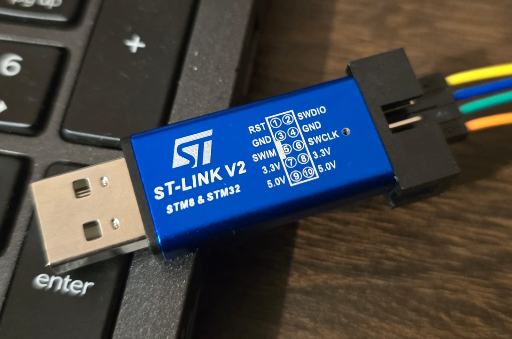

### 2. Open the case and connect the SWD pins

Open the SW102 display to expose the 4 programming pads: **GND, CLK (SWCLK), DIO (SWDIO), 3V3**.

<table>
<tr>
<td>

| SW102 pad | ST-Link V2 |
|---|---|
| GND | GND |
| 3V3 | 3.3V |
| CLK | SWCLK |
| DIO | SWDIO |

</td>
<td>

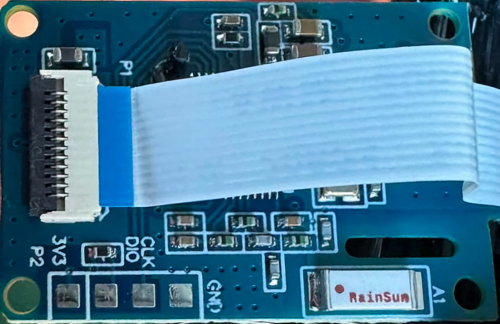

</td>
</tr>
</table>

You can power the display straight from the ST-Link's 3.3V pin for flashing - no battery or controller cable needed.

#### HOW TO OPEN SW102

The most reliable way to reach the four pads is to gently drill four small holes, side by side, with a 3mm bit, then solder onto the pads as shown below.

I don't recommend opening the button panel by force instead - it's glued firmly, and forcing it open usually damages the case enough that it can no longer be glued back together to keep it waterproof. Sealing the small drilled hole afterward with a dab of silicone, on the other hand, is easy.

The blue tape in the photos is just there so the drill doesn't accidentally scratch the display.

<table>
<tr>
<td align="center">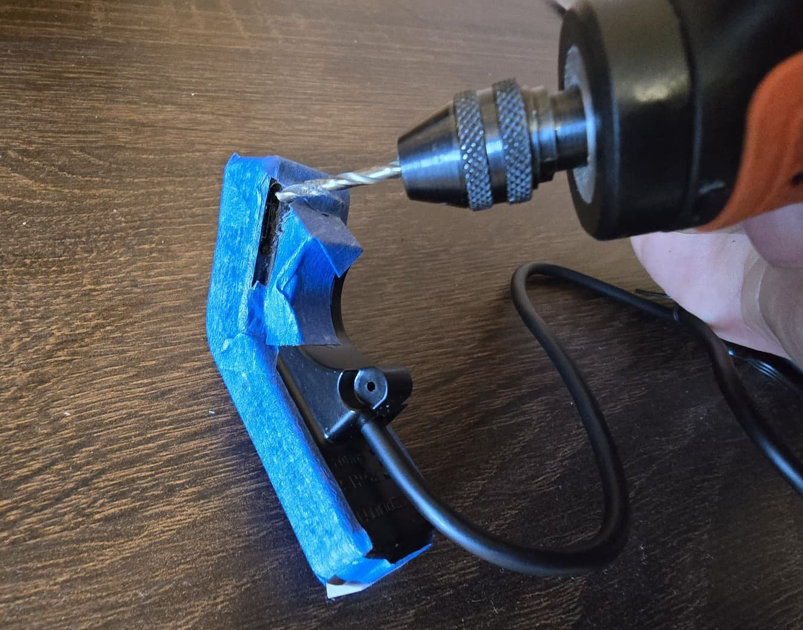</td>
<td align="center">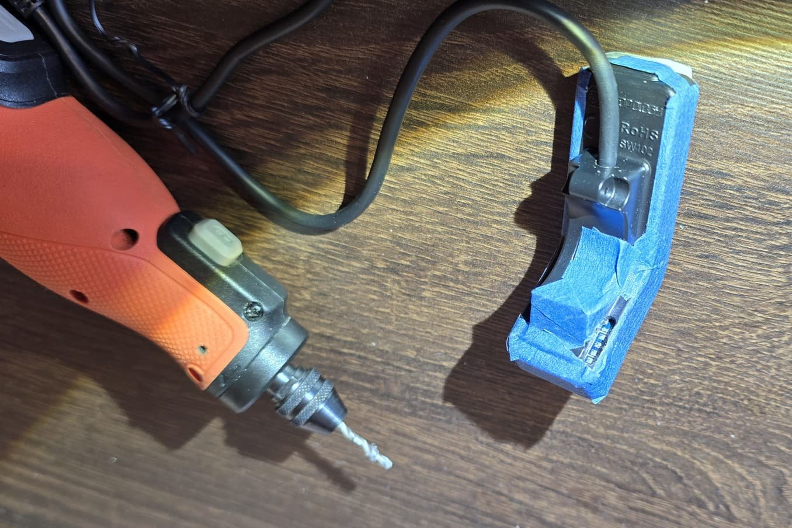</td>
<td align="center">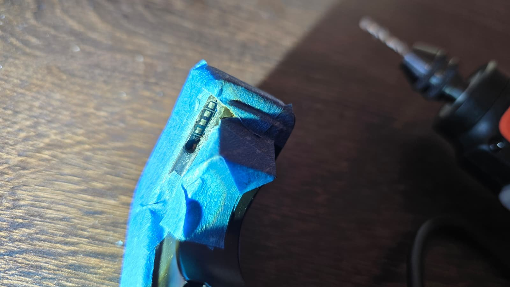</td>
<td align="center">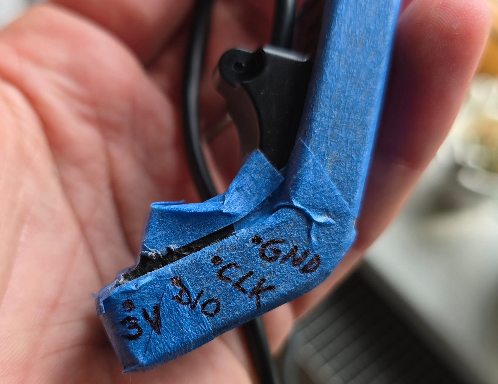</td>
</tr>
<tr>
<td align="center">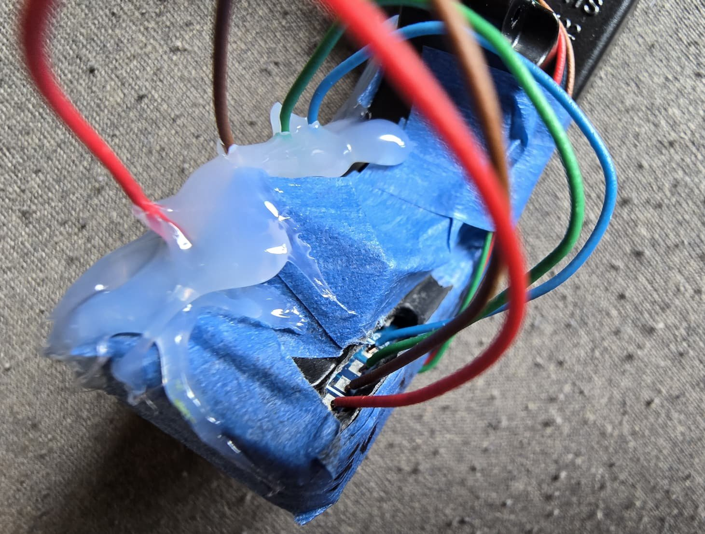</td>
<td align="center">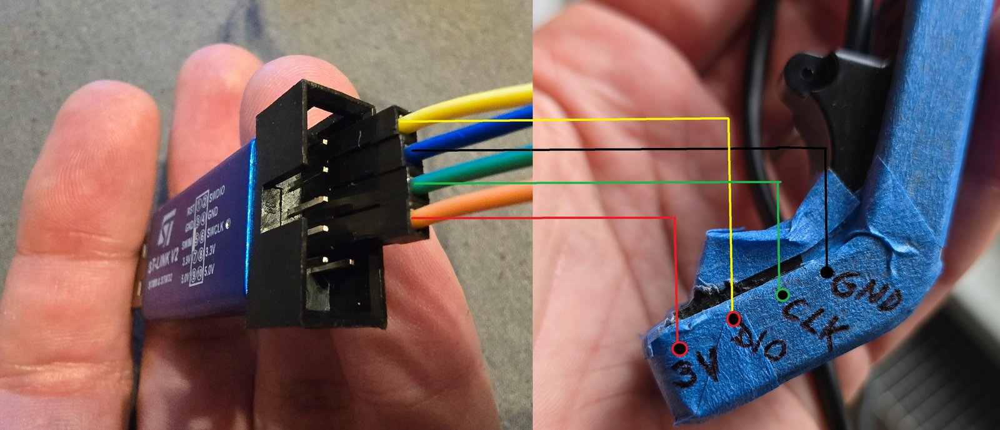</td>
<td align="center">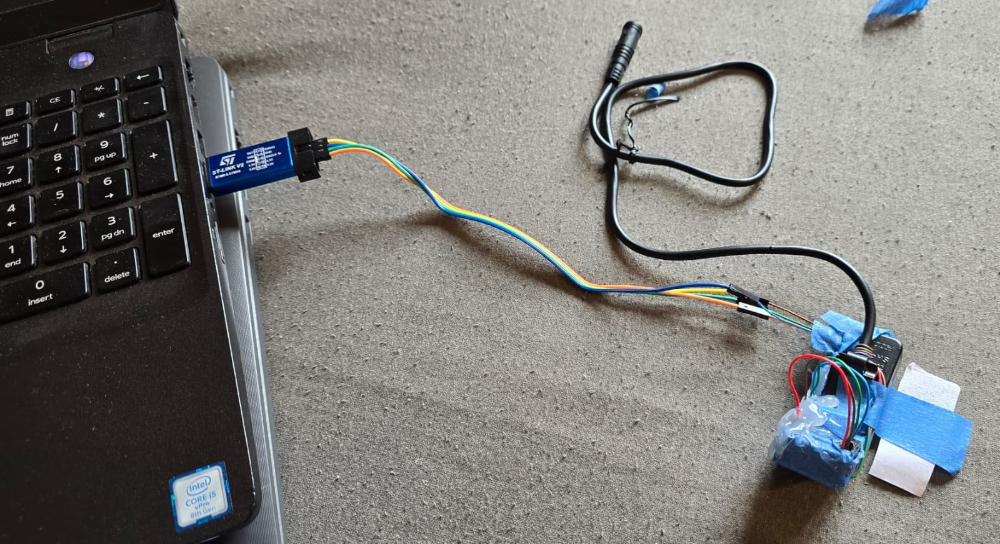</td>
</tr>
</table>

### 3. Flash the firmware

1. Open a Command Prompt (press the Windows key, type `cmd`, press Enter).
2. Go into OpenOCD's `bin` folder - adjust the path to wherever you unzipped it in "What you need":
   ```
   cd C:\OpenOCD\bin
   ```
3. Run the erase command (paste it exactly, then press Enter):
   ```
   openocd.exe -f interface/stlink.cfg -f target/nordic/nrf51.cfg -c "init; reset init; nrf51 mass_erase; shutdown"
   ```
4. Run the write-and-verify command, using the full path to wherever you saved the `.hex` file:
   ```
   openocd.exe -f interface/stlink.cfg -f target/nordic/nrf51.cfg -c "init; reset init; flash write_image C:\SW102\SW102_BAF_X.Y.Z.hex; verify_image C:\SW102\SW102_BAF_X.Y.Z.hex; reset halt; resume; shutdown"
   ```

These must be two separate commands, run one after the other - see Troubleshooting below for why. If `verify_image` reports no errors, the flash succeeded.

### 4. Check it worked

Disconnect the ST-Link, connect normal power (battery or the controller cable), and press the power button. You should see the boot screen with the firmware name and version.

### Troubleshooting

- **`Error: open failed`** - the ST-Link driver isn't installed, or the cable/USB connection is loose. Recheck step 1, unplug/replug.
- **`Error: init mode failed` / no target detected** - almost always a bad physical connection on the CLK/DIO pads. Double-check the wires are making solid contact.
- **Why two separate commands?** - Running erase and write in the same OpenOCD session fails with `error writing to flash`. The chip needs a reset in between, which is why the erase and the write-and-verify are two separate commands rather than one long one.

## Updating (Bluetooth)

Once the bootloader is installed (first flash via ST-Link), later firmware updates can be done wirelessly - no need to open the case again.

### What you need

- The **nRF Connect** app (Android/iOS, by Nordic Semiconductor)
- The firmware update package, e.g. `SW102_BAF_FW_X.Y.Z.zip`, transferred to your phone

### Steps

1. With the display powered on, hold **M + PWR together for at least 8 seconds**, until the screen goes dark - this confirms it's now in bootloader DFU mode.
2. Open **nRF Connect** on your phone, scan for Bluetooth devices, and connect to **"SW102_DFU"**.
3. Start a DFU update in the app and select the `.zip` file (don't unzip it first).
4. Wait for the upload to finish.
5. Power-cycle the display and turn it back on normally.

### Troubleshooting

- **Boots back into DFU mode instead of the app** - hold the power button longer (up to 10 seconds) on the first boot after an update; this is a known quirk of the bootloader.

## Preview (simulation)

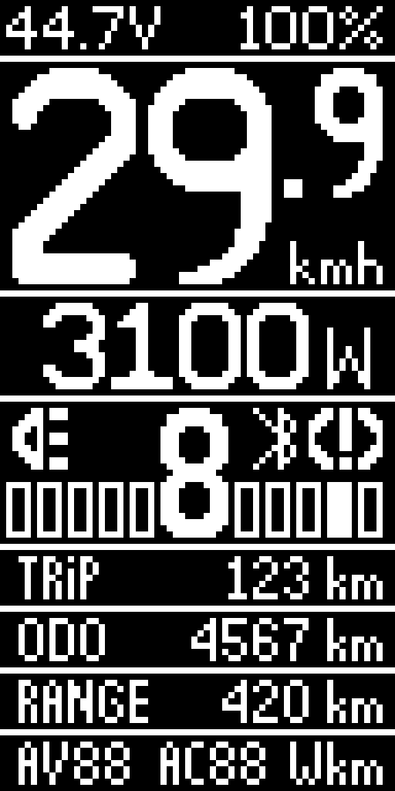

Pixel-accurate cockpit layout simulation (`font_speed_work/simulate_cockpit.py`) using the
hand-drawn fonts, used to iterate on the UI before touching C code.

## Status

Firmware tested on real hardware (flashed via SWD/OpenOCD and an ST-Link V2, current version `SW102_BAF_0.0.7`). Working on hardware: Bafang UART protocol (telemetry, lights, assist), current and voltage calibration, trip/odo with reset, km/h<->mph unit switch, menu with a marker icon instead of highlight, boot screen with version number. Versioning convention: `SW102_BAF_X.Y.Z`, each version flashed to hardware is saved as its own `.hex` file (never overwritten). Builds cleanly on both toolchains (ARM and emulator). Details and history in `research.md` and `CHANGELOG.md`.

## License and provenance

The base fork (`anszom/SW102_LCD`, itself a fork of `OpenSourceEBike/Color_LCD`) is licensed under GPL-3.0. This repository distributes only the compiled firmware image and installation instructions - source code is not published here.

## Resources

Current build (v0.1.3) flash/RAM usage on the nRF51822:

| Resource | Budget | Used | Free |
|---|---|---|---|
| Flash (application region) | 130,048 B (127.0 KB) | 59,748 B (58.3 KB) | 70,300 B (68.7 KB, 54.1%) |
| RAM (after SoftDevice reservation) | 21,504 B (21.0 KB) | 6,248 B (6.1 KB) | 15,256 B (14.9 KB, 70.9%) |

RAM figure is static `.data`+`.bss` only - runtime stack/heap live in the same free space, not counted separately.

## Changelog

Version history for the `SW102_BAF_X.Y.Z` firmware, flashed to real hardware via SWD.

### 0.1.3 (2026-09-19)

- Data screen values are now remembered across power-off, like TRIP, and cleared only by "Trip reset": total time, maximum current, maximum power and energy used. Total time can no longer be smaller than moving time (on the first start after the update it begins from the already-saved moving time)
- The data screen's CONS is now the average consumption over the TRIP shown on the same screen (energy used divided by trip distance), so the two always agree. The AV/AC row on the other two cockpit layouts is unchanged
- "Rotate Screen 180deg" is now remembered after power-off
- PAS Type A: the negative frame is 1px wider on the right and the four bars right of the number moved 1px right; the walk-assist figure moved 1px right in both types; "AC" and its value in the AV/AC row moved 1px right

### 0.1.2 (2026-09-19)

- Third cockpit layout: a plain data list (label on the left, value and unit on the right) with trip distance, average speed, top speed, total time, moving time, maximum current, maximum power, average consumption (Wh/km) and energy used (Wh). A short press of M now cycles through all three layouts
- New "Rotate Screen 180deg" option (Cockpit menu): turns the whole display upside down, with UP and DOWN swapped to match. Deliberately not remembered - after a power cycle the display always starts in the normal orientation
- The walking-person animation now also shows in PAS Type B while walk assist is held (previously only Type A did)


### 0.1.1 (2026-09-18)

- Fixed "Save failed" being shown for every save in the Assist Level Programming screen even though the data had been written: the controller confirms a write with its own short acknowledgement message, which the firmware did not expect. The save result is now based on that acknowledgement


### 0.1.0 (2026-09-18)

- New "Bafang Assist Level Programming" screen (main menu, between "Screen test" and "Info"): reads the controller's own per-assist-level (PAS 0-9) current and speed limits in percent, lets you edit them and writes them back to the controller with SAVE. It reads automatically on entry; editing and SAVE stay locked until a read has succeeded, so nothing empty is ever sent. A blinking underline shows a read or save in progress, and the result is shown as a notice
- "Trip reset" now asks for confirmation (opens a "Confirm trip reset" step, like "Factory reset") so it cannot be triggered by accident
- Fixed the menu selection marker sitting 1px too low in every menu
- Boot screen: back to the smaller skull icon
- Fixes from real-hardware testing: the PAS negative frame is 1px wider on the left, the PAS digit in Type A moved 1px, and the AV/AC row uses fixed positions so "AC" no longer drifts with the number of digits in AV


### 0.0.9 (2026-09-17)

- New complete "ODO" font (`font_odo`) replacing `font_label`/`font_il` in the TRIP/ODO/RANGE/AV/AC rows - full digit/punctuation/uppercase-letter set plus a new ">" arrow glyph, used for the new PAS arrow indicator below. Fixed a real unit-label bug found during the swap: the AV/AC row's unit was showing "Wkm"/"Wml" (missing the "h") instead of the correct "Whkm"/"Whml"
- New, larger skull-and-crossbones boot screen icon
- New large digit font (`font_bigspeed`, 30x56px) for the new cockpit layout below
- New "PAS Type" setting (Cockpit menu): **Type A** is the existing PAS row (centered digit, side bar-graph, status icons above); **Type B** moves the PAS digit to the left with status icons beside it, and shows the assist level as a row of ">" arrows instead of the bar-graph. The bar-graph itself also changed: no more segment for PAS level 0, left side now shows 5 segments (levels 1-5) and right side 4 (levels 6-9)
- "PAS bar" setting renamed to "PAS Icons" - now also controls the Type B arrow row (previously only the Type A bar-graph)
- New "PAS Negativ" setting (Cockpit menu): draws the PAS digit as a cut-out inside a filled rectangle instead of normal ink, in both Type A and Type B
- New second cockpit layout, toggled by a short press of the M button: merges the speed and power rows into one, showing only the whole-number speed as two large digits (no fraction, no unit, no power value) - the choice persists across power cycles
- Settings menu visual overhaul: entries are now left-justified (previously centered for context rows), the selection marker moved to the screen edge, and a too-long selected entry now scrolls further left before disappearing
- Safety fix: assist level now always resets to 0 on power-on, instead of restoring the last-used level from flash
- Fixed RANGE showing near-zero while the battery percentage display showed a healthy value: the range estimator was using the controller's own raw (often inaccurate) reported percentage instead of whichever percentage is actually shown on screen (Standard or Precise)

### 0.0.8 (2026-09-16)

- Fixed a DFU (BLE OTA) update failure that could leave the device stuck in the bootloader when updating to a build smaller than the one already installed (a full SWD reflash of the identical image booted fine, isolating the fault to the DFU path specifically). The application image is now padded with 0xFF up to a fixed 80KB footprint before packaging for OTA, so every update occupies the same flash region regardless of its actual size - only the OTA package is affected, the SWD image is unchanged

### 0.0.7 (2026-09-16)

- Added smoothing (exponential moving average, ~8s time constant) to the Precise battery-percentage mode only - throttle-induced voltage sag no longer makes the indicator jump around. Standard mode and the displayed voltage remain fully raw/unfiltered

### 0.0.6 (2026-09-16)

- Fixed ODO (and Trip A) resetting to 0 on every power-off or settings-menu exit: the save path was reading from a legacy field this target never populates, instead of the real value our own code maintains
- New "Battery percentage" menu option (Battery submenu) with two modes: **Standard** shows the controller's own reported percentage exactly as before; **Precise** computes the percentage locally from the display's own accurately-measured voltage and user-entered Max/Min battery voltage - for controllers whose own reported percentage runs inaccurate
- Removed/neutralized inherited leftover code found to actively corrupt live telemetry (a fake motor simulator writing garbage into trip calculations, a legacy UART frame parser with a real buffer-overflow risk) plus further confirmed-dead code from the old screen layout. Code size dropped from 66,656 to 53,244 bytes flash (~13 KB recovered) as a direct result of this cleanup

### 0.0.5 (2026-09-14)

- "Trip reset" moved to the top level of the menu, directly under "Unit"
- "Reset" submenu renamed to "Factory reset" (confirm button renamed to "Confirm factory reset")

### 0.0.4 (2026-09-14)

- Fixed a second light bug: `INIT_DISPLAY` (same bytes as "lights off") was being sent at the start of every poll cycle, not just once at startup - this raced against the real light command sent later in the same cycle and made the light blink continuously. Now sent only once at cold start or after a real communication timeout, matching EggSPEED's `DisplayStateMachine.kt` exactly

### 0.0.3 (2026-09-14)

- Fixed light bug: the light command is now sent unconditionally on every poll cycle (matching the verified behavior in EggSPEED), instead of only on state change - the previous version caused the light to blink once and turn off
- New "Trip reset" menu action (resets trip distance/time/speed and trip average energy use, while preserving long-term learned averages)
- Nudged AV/AC value positions (+1px right) and the km/h label (2px up)

### 0.0.2 (2026-09-14)

- Full km/h<->mph unit conversion: speed, distance (ODO/trip), and energy use (Wh/km<->Wh/mile) are converted at the display-formatting boundary, internal data stays in km/h and Wh/km
- New standalone `font_il` font (only "i"/"l" glyphs) for the "ml"/"Wml" labels
- New menu marker icon (`icon_menu_marker.xbm`) replacing the rectangle-highlight + inverted-text selection indicator - fixes a text-overlap glitch
- Fixed `numeric2string()`: missing leading zero in decimal values (e.g. "1.1" -> "1.01")
- Speed limit and the ODO menu editor remain deliberately km-only (a limitation of the numeric editor framework, no runtime-switchable unit)

### 0.0.1 (2026-09-14)

- First version with a version number and boot screen showing the full firmware name
- Fixed voltage calibration: real P+ voltage divider determined to be ~402 kOhm (vs. the fork's assumed 300 kOhm), verified with a multimeter on hardware (58.8V actual vs. 44.4V displayed before the fix); added a "Voltage cal." menu field
- Fixed a `uint8_t` overflow in the LCD contrast/brightness formula (`lcd_refresh()`) - backlight was rendering as binary instead of a smooth range
- New "Screen test" menu item (fills the screen white)
- Added "Dev Tomasz Pieczara" and "spotrobotics.app" to the Info menu
- Finished the "Cockpit" menu tab (ON/OFF toggles for separators and the PAS bar)
- PAS assist level bar changed to a bar-graph style (fills 0..active level)
