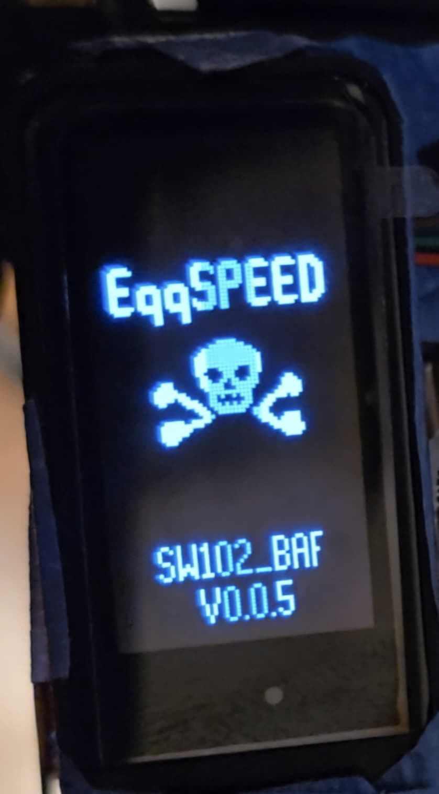
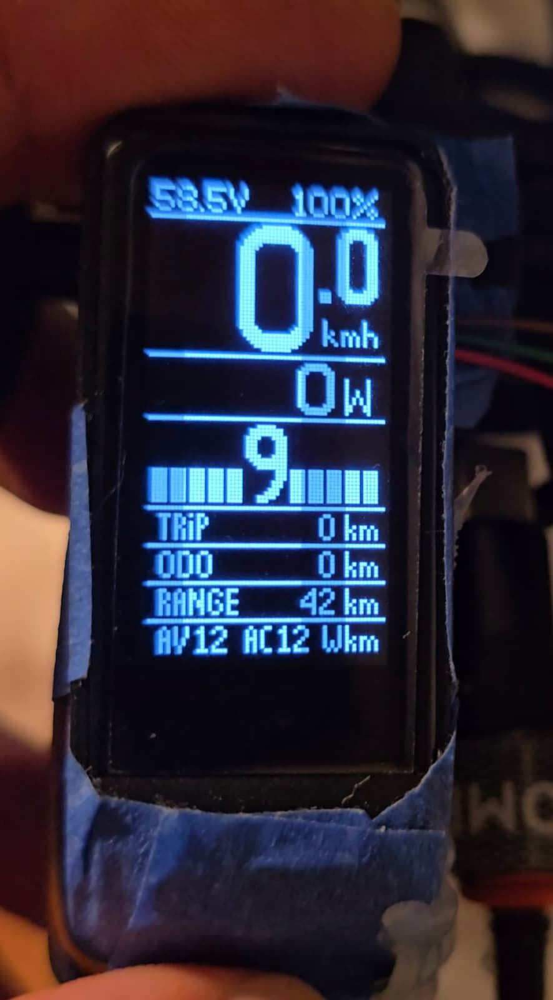
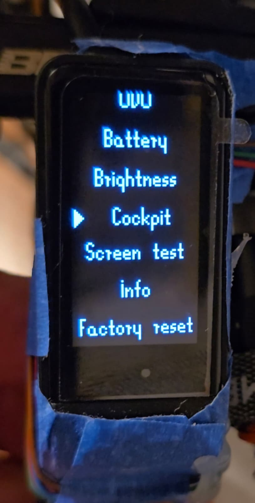
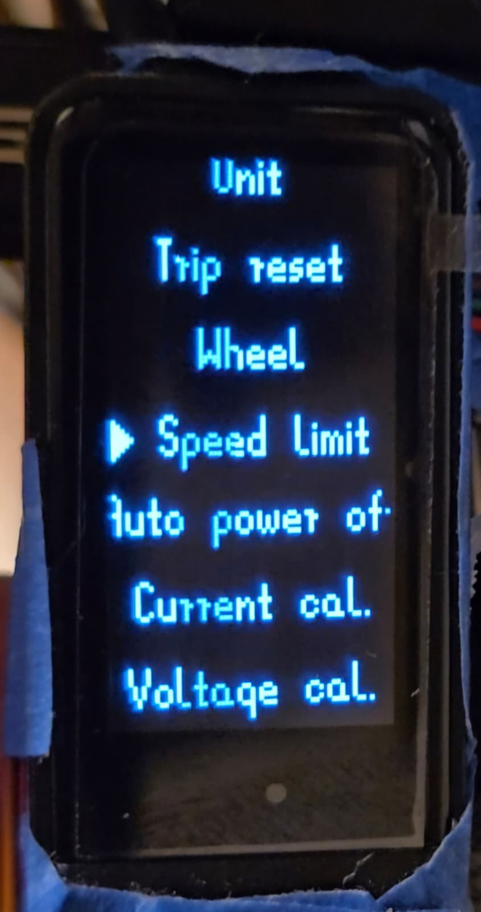

# SW102 Modded Firmware for Bafang Controllers

Open source firmware for the Bafang SW102 display, built for genuine Bafang mid-drive motors. A complete rewrite of the display's firmware - live telemetry, full assist control, lights, and a redesigned cockpit and menu, all running natively on your existing hardware. The end goal: full integration with the **EggSPEED** Android app ([GitHub](https://github.com/moskil2/EggSPEED), [Google Play](https://play.google.com/store/apps/details?id=app.spotrobotics.eggspeed)) over Bluetooth.

|  |  |  |  |
|:---:|:---:|:---:|:---:|
| 1. Boot screen | 2. Cockpit | 3. Menu (marker) | 4. Menu (top level) |

## Compatibility

Uses the standard Bafang UART display protocol - the same protocol the stock display uses across this whole controller family:

- BBS01 / BBS01B
- BBS02 / BBS02B
- BBSHD
- M400
- M420
- M620 / G510 Ultra

Tested on real hardware with a BBSHD controller.

## Cockpit (main screen)

- Top bar: battery voltage (left) and battery percentage (right)
- Speed: large digits with one decimal, unit label (km/h or mph)
- Power: motor power in watts
- Assist level: number flanked by a 10-segment bar-graph indicator, status icons above it (headlight, Bluetooth connection, brake), replaced by an animated walk-assist icon while walk assist is held
- Trip distance, Odometer, and estimated Range rows
- Average / current energy consumption row (Wh/km or Wh/mile)
- Optional separator lines between rows (toggle in menu)
- Controls: UP/DOWN short press = assist level up/down; UP long press = toggle headlight; DOWN long press (hold) = walk assist; M long press = open menu

## Menu

- Unit switch (km/h / mph)
- Wheel size selection
- Speed limit (sent directly to the controller)
- Auto power off timer
- Current calibration (adjustable display multiplier)
- Voltage calibration (adjustable display multiplier)
- ODO (manually set or correct the odometer)
- Battery submenu: pack capacity (Wh)
- Brightness submenu: manual or automatic mode, adjustable level
- Cockpit submenu: toggle separators, toggle the PAS bar
- Screen test (fills the display white for a dead-pixel check)
- Info submenu: firmware version, hardware, developer credit, website
- Reset submenu: full factory reset, trip-only reset

## Installing (ST-Link)

The simple, end-user version of the flashing procedure - tested on real hardware. No build tools needed if you're using a pre-built `.hex` release file.

### What you need

- An ST-Link V2 programmer (a cheap clone is fine, ~$5) - e.g. [search on Amazon](https://www.amazon.com/s?k=ST-Link+V2+programmer)
- A Windows PC
- **OpenOCD** - download the Windows build from the [xPack OpenOCD releases page](https://github.com/xpack-dev-tools/openocd-xpack/releases) (the `...win32-x64.zip` asset) and unzip it anywhere, e.g. `C:\OpenOCD`
- The **ST-Link driver** (see step 1 below)
- The firmware `.hex` file from this repo's Releases (e.g. `SW102_BAF_X.Y.Z.hex`) - download it and note where you saved it, e.g. `C:\SW102\`

This single `.hex` file is a complete, ready-to-flash image - it already contains the bootloader, the Nordic SoftDevice (BLE stack), and the application, merged together at build time. You don't need to download anything else from any other repository.

### 1. Install the ST-Link driver

Plugging the ST-Link into USB alone is not enough - Windows needs the driver, or OpenOCD will fail with `Error: open failed`.

1. Download **[STSW-LINK009](https://www.st.com/en/development-tools/stsw-link009.html)** from ST's website and unzip the downloaded file (e.g. into your Downloads folder).
2. Open the unzipped folder, find `stlink_winusb_install.bat`, right-click it, and choose **"Run as administrator"** from the menu.
3. Unplug and replug the ST-Link.

### 2. Open the case and connect the SWD pins

Open the SW102 display to expose the 4 programming pads: **GND, CLK (SWCLK), DIO (SWDIO), 3V3**.

<table>
<tr>
<td>

| SW102 pad | ST-Link V2 |
|---|---|
| GND | GND |
| 3V3 | 3.3V |
| CLK | SWCLK |
| DIO | SWDIO |

</td>
<td>


</td>
</tr>
</table>

You can power the display straight from the ST-Link's 3.3V pin for flashing - no battery or controller cable needed.

### 3. Flash the firmware

1. Open a Command Prompt (press the Windows key, type `cmd`, press Enter).
2. Go into OpenOCD's `bin` folder - adjust the path to wherever you unzipped it in "What you need":
   ```
   cd C:\OpenOCD\bin
   ```
3. Run the erase command (paste it exactly, then press Enter):
   ```
   openocd.exe -f interface/stlink.cfg -f target/nordic/nrf51.cfg -c "init; reset init; nrf51 mass_erase; shutdown"
   ```
4. Run the write-and-verify command, using the full path to wherever you saved the `.hex` file:
   ```
   openocd.exe -f interface/stlink.cfg -f target/nordic/nrf51.cfg -c "init; reset init; flash write_image C:\SW102\SW102_BAF_X.Y.Z.hex; verify_image C:\SW102\SW102_BAF_X.Y.Z.hex; reset halt; resume; shutdown"
   ```

These must be two separate commands, run one after the other - see Troubleshooting below for why. If `verify_image` reports no errors, the flash succeeded.

### 4. Check it worked

Disconnect the ST-Link, connect normal power (battery or the controller cable), and press the power button. You should see the boot screen with the firmware name and version.

### Troubleshooting

- **`Error: open failed`** - the ST-Link driver isn't installed, or the cable/USB connection is loose. Recheck step 1, unplug/replug.
- **`Error: init mode failed` / no target detected** - almost always a bad physical connection on the CLK/DIO pads. Double-check the wires are making solid contact.
- **Why two separate commands?** - Running erase and write in the same OpenOCD session fails with `error writing to flash`. The chip needs a reset in between, which is why the erase and the write-and-verify are two separate commands rather than one long one.

## Updating (Bluetooth)

Once the bootloader is installed (first flash via ST-Link), later firmware updates can be done wirelessly - no need to open the case again.

### What you need

- The **nRF Connect** app (Android/iOS, by Nordic Semiconductor)
- The firmware update package, e.g. `SW102_BAF_FW_X.Y.Z.zip`, transferred to your phone

### Steps

1. With the display powered on, hold **M + PWR together for at least 8 seconds**, until the screen goes dark - this confirms it's now in bootloader DFU mode.
2. Open **nRF Connect** on your phone, scan for Bluetooth devices, and connect to **"SW102_DFU"**.
3. Start a DFU update in the app and select the `.zip` file (don't unzip it first).
4. Wait for the upload to finish.
5. Power-cycle the display and turn it back on normally.

### Troubleshooting

- **Boots back into DFU mode instead of the app** - hold the power button longer (up to 10 seconds) on the first boot after an update; this is a known quirk of the bootloader.

## Preview (simulation)


Pixel-accurate cockpit layout simulation (`font_speed_work/simulate_cockpit.py`) using the
hand-drawn fonts, used to iterate on the UI before touching C code.

## Status

Firmware tested on real hardware (flashed via SWD/OpenOCD and an ST-Link V2, current version `SW102_BAF_0.0.3`). Working on hardware: Bafang UART protocol (telemetry, lights, assist), current and voltage calibration, trip/odo with reset, km/h<->mph unit switch, menu with a marker icon instead of highlight, boot screen with version number. Versioning convention: `SW102_BAF_X.Y.Z`, each version flashed to hardware is saved as its own `.hex` file (never overwritten). Builds cleanly on both toolchains (ARM and emulator). Details and history in `research.md` and `CHANGELOG.md`.

## License and provenance

The base fork (`anszom/SW102_LCD`, itself a fork of `OpenSourceEBike/Color_LCD`) is licensed under GPL-3.0. This repository distributes only the compiled firmware image and installation instructions - source code is not published here.

## Resources

Current build (v0.0.5) flash/RAM usage on the nRF51822:

**Flash** (application region, 130,048 bytes after bootloader/SoftDevice)
- Used: 66,656 bytes
- Free: ~63.4 KB (48.7%)

**RAM** (21,504 bytes available to the app, after the SoftDevice's fixed 11 KB reservation)
- Used (static `.data`+`.bss`): 6,352 bytes
- Free: ~14.8 KB (70.5%) - not counting runtime stack/heap, which live in the same free space

## Changelog

Version history for the `SW102_BAF_X.Y.Z` firmware, flashed to real hardware via SWD.

### 0.0.5 (2026-09-14)

- "Trip reset" moved to the top level of the menu, directly under "Unit"
- "Reset" submenu renamed to "Factory reset" (confirm button renamed to "Confirm factory reset")

### 0.0.4 (2026-09-14)

- Fixed a second light bug: `INIT_DISPLAY` (same bytes as "lights off") was being sent at the start of every poll cycle, not just once at startup - this raced against the real light command sent later in the same cycle and made the light blink continuously. Now sent only once at cold start or after a real communication timeout, matching EggSPEED's `DisplayStateMachine.kt` exactly

### 0.0.3 (2026-09-14)

- Fixed light bug: the light command is now sent unconditionally on every poll cycle (matching the verified behavior in EggSPEED), instead of only on state change - the previous version caused the light to blink once and turn off
- New "Trip reset" menu action (resets trip distance/time/speed and trip average energy use, while preserving long-term learned averages)
- Nudged AV/AC value positions (+1px right) and the km/h label (2px up)

### 0.0.2 (2026-09-14)

- Full km/h<->mph unit conversion: speed, distance (ODO/trip), and energy use (Wh/km<->Wh/mile) are converted at the display-formatting boundary, internal data stays in km/h and Wh/km
- New standalone `font_il` font (only "i"/"l" glyphs) for the "ml"/"Wml" labels
- New menu marker icon (`icon_menu_marker.xbm`) replacing the rectangle-highlight + inverted-text selection indicator - fixes a text-overlap glitch
- Fixed `numeric2string()`: missing leading zero in decimal values (e.g. "1.1" -> "1.01")
- Speed limit and the ODO menu editor remain deliberately km-only (a limitation of the numeric editor framework, no runtime-switchable unit)

### 0.0.1 (2026-09-14)

- First version with a version number and boot screen showing the full firmware name
- Fixed voltage calibration: real P+ voltage divider determined to be ~402 kOhm (vs. the fork's assumed 300 kOhm), verified with a multimeter on hardware (58.8V actual vs. 44.4V displayed before the fix); added a "Voltage cal." menu field
- Fixed a `uint8_t` overflow in the LCD contrast/brightness formula (`lcd_refresh()`) - backlight was rendering as binary instead of a smooth range
- New "Screen test" menu item (fills the screen white)
- Added "Dev Tomasz Pieczara" and "spotrobotics.app" to the Info menu
- Finished the "Cockpit" menu tab (ON/OFF toggles for separators and the PAS bar)
- PAS assist level bar changed to a bar-graph style (fills 0..active level)
